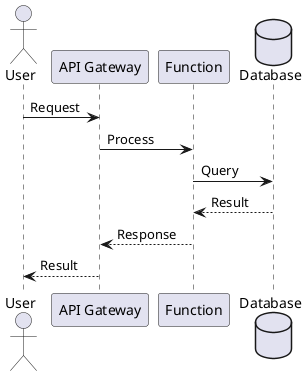

# Architecture Diagrams

This directory contains visual representations of the AI Metadata Enricher platform architecture.

## Purpose

Architecture diagrams help:
- **Communicate**: Share system design with stakeholders
- **Document**: Provide visual documentation of architecture
- **Analyze**: Identify bottlenecks and optimization opportunities
- **Onboard**: Help new team members understand the system

## Diagram Types

### System Architecture Diagrams
- High-level system overview
- Component relationships and boundaries
- External integrations
- Technology stack visualization

### Data Flow Diagrams
- Data movement through the system
- Processing pipelines
- Transformation stages
- Data sources and sinks

### Deployment Diagrams
- Azure resources and services
- Network topology
- Security boundaries
- Multi-region architecture

### Sequence Diagrams
- Interaction flows between components
- API call sequences
- Event processing flows
- Error handling scenarios

### Network Diagrams
- Virtual networks and subnets
- Network security groups
- Private endpoints and links
- Traffic routing

## Diagramming Tools

### Recommended Tools

#### Draw.io (diagrams.net)
- **Free**: Open-source and free to use
- **VS Code Integration**: Official extension available
- **Format**: Save as `.drawio` or `.drawio.svg`
- **Link**: https://www.drawio.com/

#### PlantUML
- **Text-Based**: Define diagrams as code
- **Version Control**: Easy to diff and review
- **Format**: `.puml` files
- **Link**: https://plantuml.com/

#### Mermaid
- **Markdown Integration**: Embed in Markdown files
- **GitHub Support**: Renders in GitHub
- **Format**: Code blocks in `.md` files
- **Link**: https://mermaid.js.org/

#### Azure Icons
- **Official Icons**: Use official Azure service icons
- **Download**: https://learn.microsoft.com/en-us/azure/architecture/icons/

### Tool Selection

- **Draw.io**: For detailed, polished diagrams
- **PlantUML**: For sequence and component diagrams
- **Mermaid**: For simple diagrams in documentation
- **PowerPoint/Visio**: For executive presentations (export to PDF for repo)

## File Naming Convention

```
{type}-{component}-{view}.{extension}
```

Examples:
- `architecture-overview-system.drawio.svg`
- `dataflow-enrichment-pipeline.puml`
- `deployment-production-network.drawio`
- `sequence-metadata-processing.puml`

## Best Practices

### Design Guidelines

1. **Clarity First**: Prioritize readability over detail
2. **Consistent Style**: Use consistent shapes, colors, and notation
3. **Appropriate Detail**: Match detail level to audience
4. **Legend**: Include legend for symbols and colors
5. **Title and Date**: Label diagrams with title and last updated date

### Version Control

1. **Source Files**: Commit editable source files (`.drawio`, `.puml`)
2. **Rendered Output**: Also commit rendered images (`.png`, `.svg`)
3. **Embed in Docs**: Reference diagrams from documentation
4. **Update Together**: Keep diagrams in sync with code changes

### Accessibility

1. **Alt Text**: Provide text descriptions for screen readers
2. **Color**: Don't rely solely on color to convey meaning
3. **Contrast**: Ensure sufficient contrast for readability
4. **Text Size**: Use readable font sizes

## Diagram Templates

### System Architecture Template (Draw.io)

```
Components:
├── External Systems (light blue)
├── Azure Services (blue)
├── Custom Code (green)
├── Data Stores (orange)
└── Security (red outlines)

Connections:
├── Synchronous (solid lines)
├── Asynchronous (dashed lines)
└── Data flow (arrows)
```

### Sequence Diagram Template (PlantUML)



## Common Azure Architecture Patterns

### Event-Driven Pattern
```
Trigger → Event Grid → Function → Service → Storage
```

### API Gateway Pattern
```
Client → APIM → Function/App Service → Backend Services
```

### Microservices Pattern
```
Client → Gateway → [Service 1, Service 2, Service 3] → Data Stores
```

## Review and Maintenance

### Diagram Review Checklist

- [ ] Diagram has clear title and description
- [ ] All components are labeled
- [ ] Connections show direction and type
- [ ] Legend included if needed
- [ ] Source file committed
- [ ] Rendered image committed
- [ ] Referenced in relevant documentation
- [ ] Up-to-date with current architecture

### Regular Updates

- Update diagrams when architecture changes
- Review diagrams quarterly for accuracy
- Archive outdated diagrams with version history
- Link diagrams from ADRs and architecture docs

## Example Diagram Structure

```
diagrams/
├── README.md                          # This file
├── system-architecture-overview.drawio.svg
├── system-architecture-overview.drawio
├── dataflow-enrichment-pipeline.puml
├── dataflow-enrichment-pipeline.png
├── deployment-production.drawio.svg
├── sequence-blob-upload.puml
└── network-topology.drawio
```

## Resources

- [Azure Architecture Center](https://learn.microsoft.com/en-us/azure/architecture/)
- [C4 Model](https://c4model.com/) - Context, Containers, Components, Code
- [UML Diagrams](https://www.uml-diagrams.org/)
- [Azure Architecture Icons](https://learn.microsoft.com/en-us/azure/architecture/icons/)

---

**Maintained By**: Architecture Team  
**Last Updated**: January 2026
